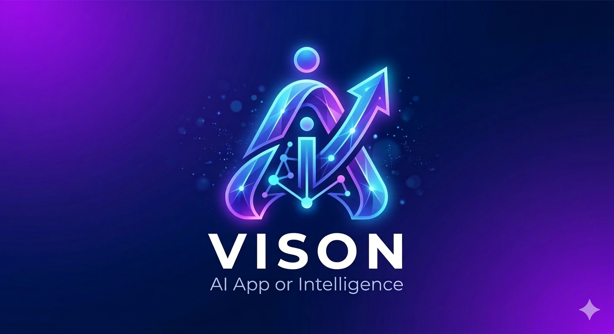

# 🚀 VISON AI: STEM Core (Master 5.0)

 > **"We are moving past Artificial Intelligence. We are entering the age of Augmented Human Intelligence."** > *Part of the BIVIC AI Integration Program.*

Welcome to the **VISON AI STEM Core**. This isn't just a chatbot; it is a secure, multi-modal, highly personalized workstation designed to supercharge STEM education and daily productivity. VISON AI adapts to the user's focus, tracks their academic evolution, and provides elite-level computational tools all in one seamless portal.

## ✨ Core Features

* 🔐 **Secure Authentication Gateway:** Robust login system requiring a registered email and security key, with a dedicated system override (password reset) and a secured Admin Vault.
* 🧠 **Multi-Modal AI Engine:** Powered by Groq's lightning-fast inference using `llama-3.3-70b-versatile` for deep reasoning and `llama-3.2-11b-vision-preview` for analyzing uploaded images of complex equations or diagrams.
* 📈 **Evolution Tracking & PDF Reports:** The system tracks user interactions to calculate an "Academic Power Level" and analyzes emotional/learning blocks. Admins can generate and download comprehensive PDF Evolution Reports.
* 🔬 **Scientific Calculator & Real-Time Graphing:** A built-in scientific calculator supporting advanced trigonometry (`sin`, `cos`, `tan`), logarithms, and constants. Users can also type "plot [equation]" in the chat to generate dynamic matplotlib graphs.
* ⏱️ **Productivity Suite:** Integrated Pomodoro focus timer to protect attention spans and a "Clear Memory" function for a clean slate.
* 🎭 **Adaptive Personas & Multilingual Support:** Switch the AI's teaching style (Strict Professor, Friendly Mentor, Quirky Scientist) and language (English, Japanese, Bahasa Melayu) on the fly.
* 🌈 **Psychological Mood Ring:** The UI dynamically changes its glowing accent colors based on the AI's analysis of the user's current learning state.

## 🛠️ Tech Stack

* **Frontend & UI:** Streamlit
* **AI Models (LLMs & Vision):** Groq API (Llama 3 Family)
* **Database:** SQLite (Local/Cloud synced)
* **Data Visualization:** Matplotlib & NumPy
* **Document Generation:** FPDF

## 🚀 How to Run Locally

1. **Clone the repository:**
   ```bash
   git clone [https://github.com/YOUR_USERNAME/vison-ai-core.git](https://github.com/YOUR_USERNAME/vison-ai-core.git)
   cd vison-ai-core
